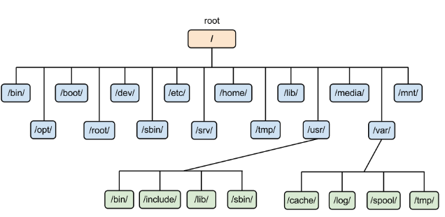

## 목차
- [리눅스 기본 커맨드](#리눅스-기본-커맨드)
- [리눅스의 기본적인 디렉토리 구성](#리눅스의-기본적인-디렉토리-구성)
- [쉘과 환경변수와 퍼미션](#쉘과-환경변수와-퍼미션)
- [리눅스의 프로세스와 쓰레드](#리눅스의-프로세스와-쓰레드)
- [리눅스의 파일 시스템](#리눅스의-파일-시스템)
- [Cheklist](#checklist)

# 리눅스 기본 커맨드

리눅스 기본 커맨드에는 어떤 것들이 있을까?

일단 Devops 커리큘럼에서 제공된 것들만 한번 알아보자.

- **cd (Change Directory)**:
    - 현재 작업 디렉토리를 변경하는 명령어
    - 예시: **`cd /home/user/documents`**는 "/home/user/documents"로 작업 디렉토리를 변경
- **pwd (Print Working Directory)**:
    - 현재 작업 디렉토리의 경로를 출력하는 명령어
    - 예시: **`/home/user/documents`**
- **ls (List)**:
    - 현재 디렉토리 내의 파일과 디렉토리 목록을 보여주는 명령어
    - 예시: **`ls -l`**은 자세한 목록을 보여줍니다.
- **cp (Copy)**:
    - 파일 또는 디렉토리를 복사하는 명령어
    - 예시: **`cp file.txt newfile.txt`**는 "file.txt"를 "newfile.txt"로 복사.
- **mv (Move)**:
    - 파일 또는 디렉토리를 이동하거나 이름을 변경하는 명령어
    - 예시: **`mv oldfile.txt newdir/`**는 "oldfile.txt"를 "newdir/"로 이동
- **mkdir (Make Directory)**:
    - 새 디렉토리를 생성하는 명령어
    - 예시: **`mkdir newdir`**는 "newdir"이라는 디렉토리를 생성
- **rm (Remove)**:
    - 파일이나 디렉토리를 삭제하는 명령어입니다. 주의가 필요
    - 예시: **`rm file.txt`**는 "file.txt"를 삭제
- **touch**:
    - 빈 파일을 생성하거나 파일의 수정 날짜를 업데이트하는 명령어
    - 예시: **`touch newfile.txt`**는 "newfile.txt"를 생성하거나 업데이트
- **ln (Link)**:
    - 파일 또는 디렉토리에 대한 링크를 생성하는 명령어
    - 하드 링크와 심볼릭 링크가 존재
- **echo**:
    - 텍스트를 화면에 출력하거나 파일에 쓰는 명령어
    - 예시: **`echo "Hello, Linux!"`**는 "Hello, Linux!"를 출력
- **cat**:
    - 파일의 내용을 화면에 표시하는 명령어
    - 예시: **`cat file.txt`**는 "file.txt"의 내용을 표시
- **tail**:
    - 파일의 끝 부분을 화면에 표시하는 명령어.
    - 예시: **`tail -n 10 file.txt`**는 "file.txt"의 끝에서 마지막 10줄을 표시
- **find**:
    - 파일 및 디렉토리를 검색하는 명령어.
    - 예시: **`find /path/to/search -name "*.txt"`**는 특정 경로에서 확장자가 ".txt"인 파일을 찾기
- **ps (Process Status)**:
    - 실행 중인 프로세스 목록을 보여주는 명령어
    - 예시: **`ps aux`**는 모든 프로세스를 자세히 표시
- **kill**:
    - 실행 중인 프로세스를 종료하는 명령어
    - 예시: **`kill PID`**는 PID로 지정된 프로세스를 종료
- **grep**:
    - 텍스트에서 패턴을 검색하는 명령어
    - 예시: **`grep "keyword" file.txt`**는 "file.txt"에서 "keyword"를 찾기
- **wc (Word Count)**:
    - 파일 또는 텍스트의 단어, 줄, 문자 수를 세는 명령어
- **df (Disk Free)**:
    - 디스크 공간 사용량을 확인하는 명령어입니다.
- **du (Disk Usage)**:
    - 디렉토리 및 파일의 디스크 사용량을 확인하는 명령어입니다.
- **파이프(|) 문자**:
    - 파이프 문자는 명령어의 출력을 다른 명령어의 입력으로 전달하는 데 사용
    - 예를 들어, **`ls | grep "keyword"`**는 "ls" 명령어의 출력을 "grep" 명령어의 입력으로 전달하여 특정 키워드를 검색

# 리눅스의 기본적인 디렉토리 구성

- **/ (루트 디렉토리)**:
    - 모든 디렉토리와 파일의 최상위 디렉토리
    - 모든 디렉토리와 파일은 이 디렉토리를 기준으로 경로가 지정
    - 루트 디렉토리는 시스템 파티션에 위치하며 시스템 부팅 시에 마운트
- **/bin (Binary)**:
    - 실행 가능한 바이너리 파일들이 저장되는 디렉토리
    - 리눅스 시스템 부팅 및 기본 명령어를 포함하는 핵심 실행 파일들이 여기에 위치
- **/sbin (System Binary)**:
    - 시스템 관리자가 사용하는 시스템 바이너리 파일들이 저장되는 디렉토리
    - 시스템 관리 작업과 관련된 실행 파일들이 여기에 위치
- **/etc (Etcetera)**:
    - 시스템의 구성 파일(configuration files)이 위치하는 디렉토리
    - 네트워크 설정, 사용자 계정 관리, 서비스 설정 등을 포함
- **/dev (Device)**:
    - 장치 파일(device files)이 저장되는 디렉토리
    - 하드웨어와 상호작용하기 위한 특수 파일들이 여기에 위치
- **/home**:
    - 사용자 홈 디렉토리들이 저장되는 디렉토리
    - 각 사용자는 **`/home`** 디렉토리 아래에 자신의 홈 디렉토리를 사용
- **/root**:
    - 시스템 관리자 또는 슈퍼유저(root)의 홈 디렉토리
    - 일반 사용자가 아닌 시스템 관리자의 홈 디렉토리로 사용
- **/tmp (Temporary)**:
    - 임시 파일들이나 디렉토리가 저장되는 곳
    - 시스템 전반적으로 사용 가능한 임시 공간을 제공
- **/var (Variable)**:
    - 시스템 실행 중에 **변하는 데이터와 파일을 저장**하는 디렉토리
    - 로그 파일, 프로세스 ID 파일, 프린터 대기열 등을 포함
- **/usr (User System Resources)**:
    - **시스템에서 사용되는 주요 응용 프로그램과 파일들이 저장**되는 디렉토리
    - **`/usr/bin`**, **`/usr/sbin`** 디렉토리에 일반적인 명령어와 시스템 실행 파일들이 존재
- **/lib (Library)**:
    - 실행 파일에서 필요한 라이브러리 파일들이 저장되는 디렉토리
    - **`/lib`** 및 **`/lib64`** 디렉토리에 공유 라이브러리 파일들이 존재.
- **/opt (Optional)**:
    - 선택적 소프트웨어 패키지와 응용 프로그램을 설치하는 데 사용되는 디렉토리
    - 주로 제 3자 소프트웨어를 설치할 때 사용
- **/mnt (Mount)**:
    - 외부 디스크 및 파일 시스템을 마운트할 때 사용되는 디렉토리
- **/media**:
    - 이동식 미디어(USB 드라이브, CD-ROM 등)를 마운트할 때 사용되는 디렉토리
- **/proc (Process Information)**:
    - 현재 실행 중인 프로세스 정보를 제공하는 가상 파일 시스템

# 쉘과 환경변수와 퍼미션

**쉘(shell)**:

- 쉘은 사용자와 운영 체제 사이의 인터페이스 역할
- 사용자가 명령어를 입력하고 실행할 수 있도록 해주며, 명령어를 해석하고 실행
- 리눅스 시스템에서 가장 일반적으로 사용되는 쉘은 **`sh`**, **`bash`**, **`zsh`** 등이 존재

**환경변수(environment variable)**:

- 환경변수는 시스템 및 사용자 환경 설정을 저장하는 데 사용되는 변수
- 환경변수는 프로세스 간 정보 공유, 시스템 설정 관리 등에 유용

**퍼미션(permission)**:

- 리눅스 파일 및 디렉토리에 대한 접근 권한을 관리하는 시스템
- 퍼미션은 파일을 읽기, 쓰기, 실행하기 위한 권한을 지정하며, 소유자, 그룹, 기타 사용자에 대한 권한을 설정

**상세 설명**

- **1. 쉘(shell)**:
    - **`sh`**, **`bash`**, **`zsh`**는 리눅스 및 유닉스 시스템에서 사용되는 쉘 프로그램의 종류
    - **`sh`**는 Bourne 쉘로, 기본적인 쉘 환경을 제공
    - **`bash`**는 Bourne Again 쉘로, 더 많은 기능을 제공하며 일반적으로 기본 로그인 쉘로 사용
    - **`zsh`**는 Z 쉘로, 확장성이 뛰어나고 다양한 기능을 제공
- **2. .bash_profile, .bashrc, .zshrc**:
    - 이 파일들은 쉘 환경 설정 파일
    - **`.bash_profile`**은 로그인 시 실행되며, 주로 환경 변수 및 사용자 정의 명령어를 설정
    - **`.bashrc`**는 각 새로운 쉘 세션(터미널 창)이 열릴 때 실행되며, 주로 쉘의 동작을 구성
    - **`.zshrc`**는 Z 쉘인 **`zsh`**에 대한 환경 설정 파일입니다.
- **3. env, set, unset, export**:
    - **`env`**: 현재 환경 변수를 나열하는 명령어
    - **`set`**: 쉘 변수와 환경 변수를 설정하는 명령어
    - **`unset`**: 변수를 제거하거나 환경 변수를 초기화하는 명령어
    - **`export`**: 변수를 현재 세션 및 하위 프로세스에 내보내는 명령어
- **4. chmod, chown, chgrp**:
    - **`chmod`**: 파일 및 디렉토리의 퍼미션을 변경하는 명령어
    - **`chown`**: 파일 및 디렉토리의 소유자를 변경하는 명령어
    - **`chgrp`**: 파일 및 디렉토리의 그룹 소유권을 변경하는 명령어
- **5. setuid, Sticky bit**:
    - **`setuid`**는 실행 파일에 설정된 비트로, 파일을 실행하는 사용자의 권한이 파일의 소유자 권한으로 변경
    - `Sticky bit`은 디렉토리에 설정되는 비트로, 다른 사용자가 해당 디렉토리에 있는 파일을 삭제할 때 오직 파일 소유자만 삭제

# 리눅스의 프로세스와 쓰레드

- 프로세스
    - 리눅스에서 프로세스는 실행 중인 프로그램을 나타냄.
    - 각 프로세스는 독립된 메모리 공간을 가지며, 자신만의 실행 환경과 리소스를 관리
    - 프로세스 간 통신(IPC)을 위한 다양한 메커니즘을 제공(파이프, 소켓, 공유 메모리 등)
    - 각 프로세스는 고유한 프로세스 ID(PID)를 가지고 있으며, 부모 프로세스와 자식 프로세스의 계층 구조를 형성할 수 있음.
- 스레드
    - 스레드는 프로세스 내에서 실행되는 가볍고 독립적인 실행 단위
    - 하나의 프로세스 내에서 여러 스레드가 동시에 실행될 수 있으며, 스레드는 프로세스 내부의 자원을 공유
    - 스레드 간 통신은 메모리 공유를 통해 이루어짐
    - 멀티스레딩은 병렬 처리를 가능하게 하며, 효율적인 자원 활용을 위해 사용

# 리눅스의 파일 시스템

<aside>
💡 **파일시스템**

컴퓨터 시스템에서 데이터를 저장하고 조직화하는 방법을 정의한 체계적인 방식

</aside>

- **리눅스의 대표적인** **파일 시스템** (ext4, xfs, btrfs 등):
    - ext4는 기본적인 파일 시스템으로 많이 사용되며, 안정성과 성능을 제공
    - xfs는 대용량 파일 시스템에 적합하며, 빠른 속도와 확장성을 제공
    - btrfs는 고급 기능을 제공하며, 스냅샷, 압축, 데이터 무결성 검사 등의 기능을 지원
- **가상 파일 시스템 (Virtual File System, VFS)**:
    - 리눅스에서는 다양한 파일 시스템을 지원하며, VFS를 통해 이러한 다양한 파일 시스템을 통일된 인터페이스로 사용
    - VFS는 시스템의 입출력 연산을 추상화하고, 각 파일 시스템에 대한 드라이버를 제공하여 다양한 파일 시스템을 지원합니다.

# Checklist

1. **리눅스의 파이프 문자는 어떤 역할을 하나요?**
    - 파이프 문자(**`|`**)는 리눅스에서 두 개의 명령어를 연결하는데 사용됩니다.
    - 왼쪽 명령어의 출력을 오른쪽 명령어의 입력으로 전달하여 데이터를 처리하거나 필터링할 수 있습니다.
    - 예를 들어, **`ls -l | grep ".txt"`** 명령은 현재 디렉토리의 파일 목록에서 확장자가 ".txt"인 파일만 출력합니다.
2. **리눅스의 셸은 어떤 역할을 하나요? bash와 zsh는 어떻게 다른가요?**
    - 셸(Shell)은 사용자와 리눅스 커널 간의 인터페이스 역할을 합니다. 사용자가 명령을 입력하고 실행할 수 있도록 합니다.
    - bash(Bourne Again Shell)는 기본적으로 많이 사용되는 리눅스 셸로, 다양한 기능과 확장성을 제공합니다.
    - zsh(Z Shell)은 bash와 유사하지만 더 많은 고급 기능과 커스터마이징 옵션을 제공하며 사용자 친화적인 셸입니다.
3. **리눅스의 권한 체계는 어떻게 이루어져 있나요?**
    - 리눅스의 권한 체계는 파일과 디렉토리에 대한 액세스 권한을 관리합니다.
    - 주요 권한은 읽기(read), 쓰기(write), 실행(execute) 권한이며, 각각 소유자, 그룹, 다른 사용자에게 부여됩니다.
    - 권한은 파일의 소유자(owner), 그룹(group), 그리고 다른 사용자(other)에 대해 설정됩니다.
4. **프로세스와 쓰레드는 무엇인가요?**
    - 프로세스는 실행 중인 프로그램을 나타내며, 독립된 메모리 공간과 자원을 갖습니다.
    - 쓰레드는 하나의 프로세스 내에서 실행되는 작은 실행 단위로, 프로세스 내부의 자원을 공유합니다.
5. **현재 실행되고 있는 프로세스들 중 PID가 1인 프로세스는 어떤 역할을 할까요? init과 systemd는 무엇이고 어떻게 다른가요?**
    - PID 1은 시스템 초기화 프로세스인 "init"이나 "systemd"의 프로세스를 나타냅니다.
    - **init**는 리눅스의 초기 부팅 및 시스템 관리 작업을 담당하는데, 시스템 리소스를 초기화하고 다른 프로세스를 시작합니다.
    - **systemd**는 **init의 대체제**로 더 빠른 부팅 및 고급 시스템 관리 기능을 제공합니다.
6. **파일 시스템이란 무엇일까요? 어떤 것이 있을까요? 지금 다루는 운영체제는 어떤 파일 시스템을 쓰고 있나요?**
    - 파일 시스템은 데이터를 저장하고 관리하는 방법을 정의한 체계입니다.
    - **리눅스에서는 ext4, xfs, btrfs와 같은 파일 시스템을 사용**합니다. 다양한 파일 시스템이 있으며, 용도에 따라 선택됩니다.
7. **리눅스의 배포판이란 무엇일까요? 여러 가지 배포판들은 어떻게 생겨났을까요?**
    - 리눅스 배포판은 리눅스 커널과 함께 기본 시스템 유틸리티, 소프트웨어 패키지, 사용자 환경 등을 포함하는 완전한 운영 체제 패키지입니다.
    - 배포판은 커뮤니티나 기업에 의해 개발되며, 다양한 용도와 사용자 요구에 맞게 조정됩니다.
8. **리눅스의 패키지 시스템이란 무엇일까요? 이러한 시스템이 생긴 이유는 무엇일까요?**
    - 리눅스 패키지 시스템은 소프트웨어 설치, 업데이트, 관리를 위한 도구와 방법을 포함하는 시스템입니다.
    - 패키지 시스템은 소프트웨어 배포와 관리를 효율적으로 하기 위해 생겨났으며, 의존성 관리, 버전 관리 등을 지원합니다.
9. **deb과 rpm은 어떤 차이가 있을까요?**
    - **`deb`**와 **`rpm`**은 리눅스 배포판 간의 소프트웨어 패키지 포맷입니다.
    - **`deb`**는 Debian과 Ubuntu와 같은 배포판에서 주로 사용되며, **`rpm`**은 Red Hat과 CentOS와 같은 배포판에서 주로 사용됩니다.
    - 포맷의 차이로 인해 패키지 관리 도구가 다를 수 있으며, 패키지 명칭과 의존성 해결 방법도 다를 수 있습니다.
10. **RPM이 있는데 yum과 같은 시스템이 나온 이유는 무엇일까요?**
    - **`yum`**은 **`rpm`** 패키지를 손쉽게 설치하고 **의존성을 해결하기 위한 편리한 인터페이스를 제공하는 패키지 관리 도구**입니다.
11. **vi는 어떤 에디터인가요? vi와 vim은 어떻게 다를까요? vi는 왜 모든 리눅스의 기본 에디터가 되었을까요?**
    - **`vi`**는 텍스트 편집기로, 리눅스 및 유닉스 시스템에서 널리 사용됩니다.
    - **`vim`**은 **`vi`**의 향상된 버전으로, 더 많은 기능과 플러그인을 제공하며 사용자 정의가 가능합니다.
    - **`vi`**와 **`vim`**은 터미널 환경에서 텍스트 파일을 효과적으로 편집하는 데 사용됩니다.
    - **`vi`**가 리눅스 기본 에디터로 선호되는 이유 중 하나는 미니멀한 디자인과 거의 모든 유닉스 및 리눅스 시스템에 포함되어 있기 때문입니다.