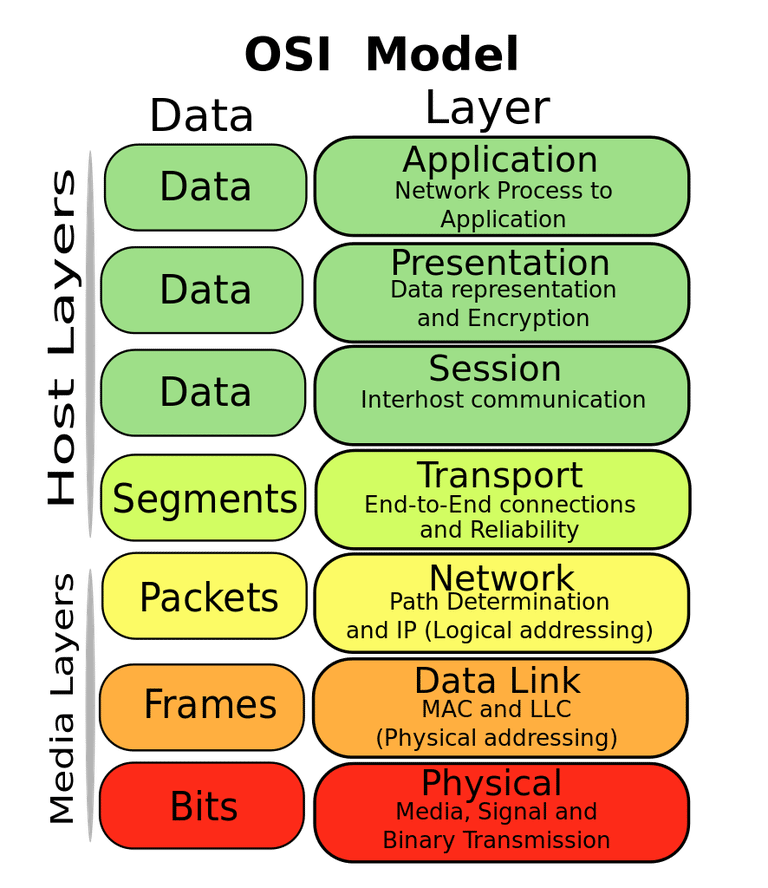

## 목차
- [인터넷은 어떻게 동작할까](#인터넷은-어떻게-동작할까)
- [브라우저에서 웹사이트로 접속하는 과정](#브라우저에서-웹사이트로-접속하는-과정)
- [Quest](#quest)
    - [Tracert](#tracertwindows가-아닌-경우-traceroute-명령을-통해-wwwgooglecom-까지-가는-경로를-찾아-보세요)
    - [Whireshark](#wireshark를-통해-wwwgooglecom-으로-요청을-날렸을-떄-어떤-tcp-패킷이-오가는지-확인해-보세요)

# 인터넷은 어떻게 동작할까?


인터넷의 동작을 OSI 7 Layer 모델과 연결하여 설명해보자.



**OSI 모델은 네트워크 통신을 7개의 계층로 나누어 설명하는 방법**이며, **인터넷의 동작도 이러한 계층를 기반**으로 한다. 

1. 물리 계층(**Physical Layer)**
    - **데이터 비트를** **전기 신호, 광 신호 등으로 변환하여 전송 매체를 통해 전달**
    ⇒ 이 때, 케이블, 광섬유, 무선 전파 등의 물리적 매체를 사용
2. 데이터 링크 계층(**Data Link Layer)**
    - **데이터 프레임을 생성**하고, **물리적인 매체를 통해 안전하게 전송하기 위한 규칙과 프로토콜을 제공**
    - **MAC 주소를 사용**하여 **장치를 식별**하며, **오류 감지와 수정을 수행**
3. 네트워크 계층**(Network Layer)**
    - **데이터 패킷을 목적지로 안전하게 전달하기 위한 경로 선택**과 **라우팅을 수행**
    - IP 주소를 사용하여 **목적지를 식별**하며, **라우터를 통해 패킷을 다음 라우터로 전달**
4. 전송 계층**(Transport Layer)**
    - **데이터의 신뢰성과 흐름을 관리**
    - **주로 사용되는 프로토콜로는 TCP와 UDP**가 있으며,
        - TCP는 신뢰성 있는 전송을 보장
        - UDP는 비 연결성 프로토콜로 빠른 데이터 전송을 지원
5. 세션 계층**(Session Layer)**:
    - 데이터 통신의 "세션"을 설정, 관리하고 종료.
        - 세션은 데이터 교환의 시작과 끝을 의미하며, 웹 브라우징 세션, 파일 전송 세션 등이 존재
    - 세션을 만들고 관리하기 위한 다양한 프로토콜과 기능을 제공
6. 표현 계층**(Presentation Layer)**:
    - 데이터의 표현과 변환을 관리
        - 데이터의 형식, 인코딩, 압축, 암호화 등을 다룸
    - 예를 들어, 텍스트 데이터를 ASCII에서 UTF-8로 변환하거나, 이미지 데이터를 압축하여 전송하는 등의 작업을 수행 
    ⇒ 이로써 데이터의 호환성과 보안을 제공
7. 응용 계층**(Application Layer)**:
    - 사용자와 상호작용하는 응용프로그램을 지원하며, 이 계층에서 웹 브라우저, 이메일 클라이언트, 파일 전송 애플리케이션 등 다양한 서비스가 동작
    - 응용 프로토콜 (예: HTTP, FTP, SMTP)을 사용하여 데이터를 주고받으며, 사용자가 데이터를 입력하고 결과를 표시하는 역할

이해하기 쉽게 설명해준 블로그

[1. OSI 7계층](https://adrian0220.tistory.com/84)

# 브라우저에서 웹사이트로 접속하는 과정


[웹 브라우저에 URL을 입력하면 어떤 일이 생기나요? | Amazon Web Services](https://aws.amazon.com/ko/blogs/korea/what-happens-when-you-type-a-url-into-your-browser/)

1. **웹 브라우저에 URL을 입력하고 Enter 키를 누릅니다.**
    1. 사용자가 웹 브라우저의 주소 표시줄에 웹사이트의 URL(Uniform Resource Locator)을 입력
2. **웹 브라우저가 도메인의 IP 주소를 조회합니다**
    1. 브라우저는 입력한 URL에서 호스트 부분을 추출하고, 이 호스트 이름을 IP 주소로 변환하기 위해 DNS 서버에 요청
    2. DNS 서버는 도메인 이름과 연결된 IP 주소를 찾아 응답
    3. 이 단계에서 DNS 캐시 (로컬에 저장된 DNS 정보)를 확인하고, 없으면 더 상위 수준의 DNS 서버로 요청을 전달
    4. DNS 서버가 호스트 이름을 해당 웹사이트의 IP 주소로 변환한 응답을 브라우저에 반환
3. **웹 브라우저가 찾은 IP 주소를 기반으로 서버와의 TCP 연결을 시작합니다**.
    1. 이 연결은 사용자와 웹 서버 간에 데이터를 안전하게 전달하기 위한 가상적인 터널을 생성
4. **웹 브라우저가 HTTP 요청을 서버로 전송합니다. (필요한 경우, HTTPS 보안 통신이 진행됩니다.)**
    1. 이 요청에는 사용자가 원하는 페이지, 브라우저 종류 및 버전, 사용자 에이전트 정보 등이 포함
    2. 예를 들어, "GET /index.html HTTP/1.1"과 같은 요청이 전송
5. **웹 서버가 요청을 처리하고 응답을 다시 웹 브라우저로 전송합니다.**
    1. 웹 서버는 요청을 받아들이고, 요청된 웹 페이지 또는 리소스를 가져와 HTTP 응답을 생성하여 브라우저로 전송. 
    2. 이 응답에는 웹 페이지의 내용, HTTP 상태 코드 (예: 200 OK), 헤더 정보, 쿠키 등이 포함
6. **웹 브라우저가 전송 받은 콘텐츠를 렌더링합니다.**
    1. 브라우저는 받은 응답을 해석하고, 웹 페이지를 렌더링하여 사용자에게 표시

# Quest

### tracert(Windows가 아닌 경우 traceroute) 명령을 통해 `www.google.com` 까지 가는 경로를 찾아 보세요.


```jsx
최대 30홉 이상의
www.google.com [142.250.66.36](으)로 가는 경로 추적:

  1    <1 ms    <1 ms    <1 ms  나의 PC IP
  2     3 ms     3 ms     5 ms  ISP_router_ip
  3     *        5 ms     3 ms  another_router_ip
  4     1 ms    <1 ms     1 ms  ------------
  5     1 ms     1 ms     1 ms  ------------
  6     2 ms     1 ms     1 ms  ------------
  7     5 ms     6 ms     6 ms  ------------
  8     *        *        *     요청 시간이 만료되었습니다.
  9     5 ms     6 ms     6 ms  ------------
 10    41 ms    40 ms    40 ms  ------------
 11    41 ms    40 ms    40 ms  ------------
 12    41 ms    40 ms    40 ms  ------------
 13    39 ms    40 ms    39 ms  ------------
 14    38 ms    38 ms    38 ms  ------------
 15    39 ms    38 ms    39 ms  hkg12s26-in-f4.1e100.net [142.250.66.36]

추적을 완료했습니다.
```

### Wireshark를 통해 `www.google.com` 으로 요청을 날렸을 떄 어떤 TCP 패킷이 오가는지 확인해 보세요


```jsx
No.  Time            Source         Destination    Protocol   Length  Info
1    0.000000        Your_IP        Google_IP      TCP       66      [SYN] ...

2    0.023456        Google_IP      Your_IP        TCP       60      [SYN, ACK] ...

3    0.023512        Your_IP        Google_IP      TCP       54      [ACK] ...

4    0.024316        Your_IP        Google_IP      HTTP      340     GET / HTTP/1.1

5    0.046789        Google_IP      Your_IP        TCP       60      [ACK] ...

6    0.064789        Google_IP      Your_IP        TCP       3526    [PUSH, ACK] ...
...
```

너무 많은 패킷이 발생하여.. 예시로 대체합니다.